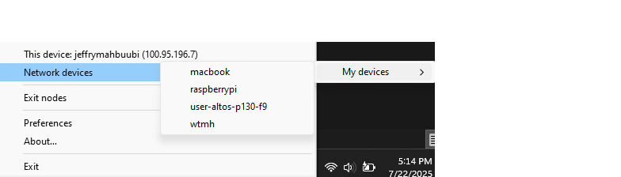

# Raspberry Pi VPN

The problem with using headless mode to connect to Raspberry Pi is the necessity to connect both the desktop/laptop and Raspberry Pi to the same network. A solution using a Virtual Private Network (VPN) can solve this issue. There are many VPN options; however, using [Tailscale](https://tailscale.com/) makes the setup very straightforward and it supports Windows, macOS, and Linux-based systems.

## Setup Tailscale

1. On your desktop/laptop, install Tailscale based on your platform:
   - **Windows:** Install using the `.exe` file
   - **macOS:** Install using the `.pkg` file (recommended)

   After installation, log in to the service.
2. Make sure to `Connect` your desktop/laptop through the Tailscale app.

3. On Linux-based systems, it is preferable to install using the terminal. Follow these steps:

    ```bash
    curl -fsSL https://tailscale.com/install.sh | sh
    sudo tailscale up
    ```

   - Check if Tailscale is installed properly by typing the command:
     ```bash
     sudo tailscale status
     ```

4. Verify that the Raspberry Pi is connected to the Tailscale VPN by checking:
   **Network Devices** ➡️ **My devices** ➡️ Confirm that `raspberrypi` appears as shown in the following picture:

<div align="center">
    
</div>

5. Connect to the Raspberry Pi remotely from your desktop/laptop by typing the command:
   ```bash
   ssh {username}@{tailscale_ip_address}
   ```

